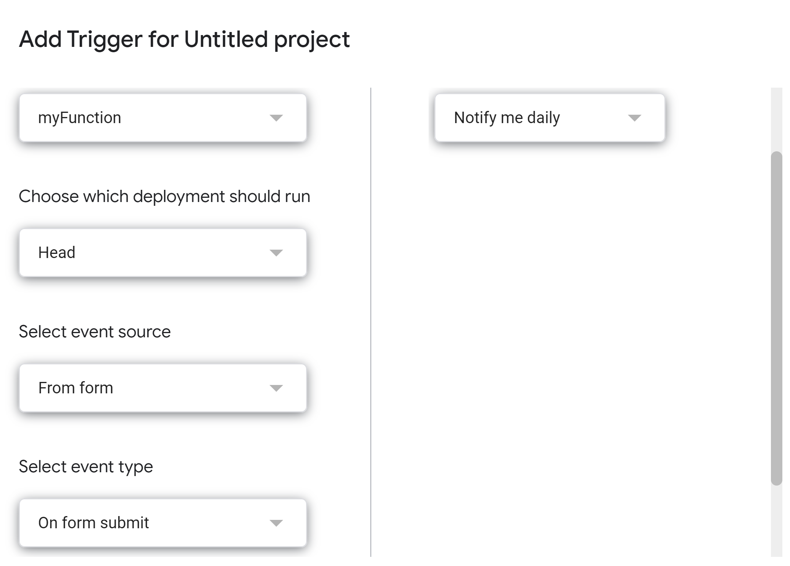

# Google Forms To Telegram Bot Hook
## Introduction
A small script and tutorial for a hook that posts a message to a Telegram group when a Google Forms gets responses like so:


## How To
### Set up a telegram bot
- In telegram, create a new bot by messaging ```@BotFather```
- Make note of the **token** it sends you
- Add your bot to the telegram group you want, and give it admin access
- send a message to the bot in the group:
    - ```/test @yourBotName```
- navigate to https://api.telegram.org/bot\<YourBot:Token\>/getUpdates
- Make note of the ```{ id: -ZZZZZZZZ, ... }``` field


### Create the script
- In your Google Forms access the **Script Editor**:

- Copy the contents of the script from the code.gs-file and fill in your **token** and **groupId**
- Navigate to the triggers page

- Add a new trigger that triggers on form submit

- Test out that everything works by sending in a new response to your form
- Enjoy the notifications from your form